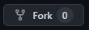
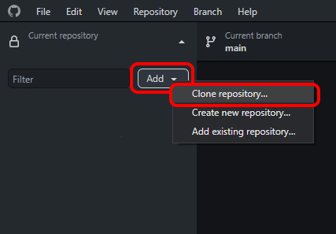
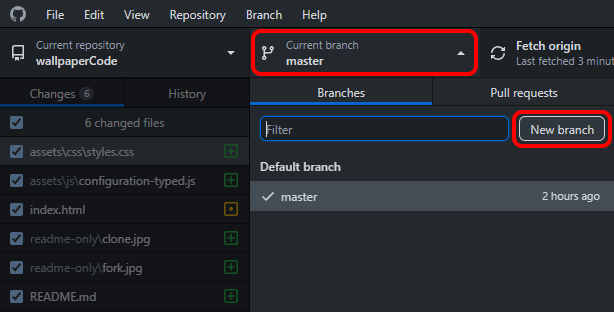
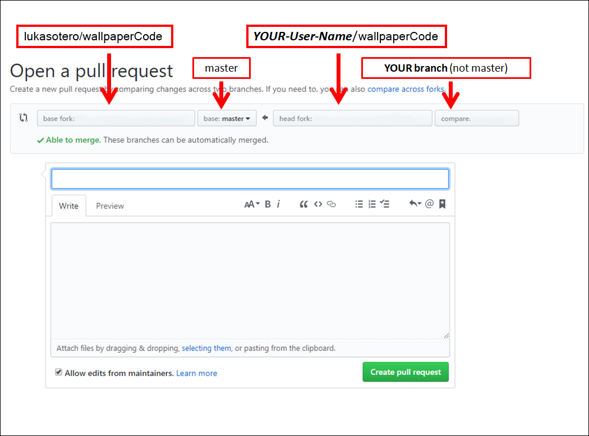

# Wallpaper Code

_Just a wallpaper, you can use it on Wallpaper Engine._

## Built with 🛠️

- [Javascript](https://developer.mozilla.org/en-US/docs/Web/JavaScript/Reference) - Version: ES12
- [typed.js](https://github.com/mattboldt/typed.js/) - Library -> v2.0.12
- [HTML](https://developer.mozilla.org/en-US/docs/Web/HTML) - v5
- [CSS](https://developer.mozilla.org/en-US/docs/Web/CSS) - v3

## How to contribute 🤝

### Step 1: Fork this repository

- The objective here is to make a copy of this project and place it in your account.
- A repository (repo) is how a project is called on GitHub and a fork is a copy of it.
- Make sure you are on the [main page](https://github.com/lukasotero/wallpaperCode "https://github.com/lukasotero/wallpaperCode") of this repo.

---

### Step 2: Clone the forked repository

- Now we want to make a local copy of the project. That is a copy saved on your own machine.
- Open the GitHub desktop app. In the app:

---

### Step 3: Create a branch

- Once the repo has been cloned and you have it open in GitHub desktop it is time to create a new branch.
- A branch is a way to keep your changes separate from the main part of the project called `Master`. For example if things go wrong and you are not happy with your changes you can simply delete the branch and the main project won't be affected.

- You can name it whatever you want, but since this is a branch to add a card with your name to the project

- Now you have created a new branch separate from the master.
- For the next steps make sure you are working in this branch. You will see the name of the branch you are on at the top center of the GitHub desktop app where it says _Current branch_.

**Do NOT work on the `master` branch**

---

### Step 4: Open the index.html file

- Now we need to open the file we are going to edit with your favourite code editor.
- Find the project folder on your computer.
- The `index.html` file is directly in the `wallpaperCode` folder.
- Now you have the file you are going to edit open in your editor and you are ready to start making changes to it.

---

### Step 5: Commit your changes

- Go back to the GitHub desktop app.
- Your changes will have been added automatically to the staging area.
- This means that Git has recorded all the **saved** changes.
- You can see this reflected in the app. Everything you have added to the file will be in green, and deletions will show as red.

---

### Step 6: Push your changes to GitHub

- Your changes are now saved or committed. But they are saved only locally, that is on your computer.
- Synchronizing local changes with your repository on GitHub is called a _Push_. You are "pushing" the changes from your local repository to the remote repository on GitHub.
- After a few seconds the operation is complete and now you have exactly the same copy of this branch on your machine as well as on GitHub.

---

### Step 6: Submit a PR (Pull Request)

- This is the moment you have been waiting for; submitting a _Pull Request_ (PR).
- So far all the work you have done has been on the fork of the project, which as you remember resides on your own account of GitHub.
- Now it's time to send your changes to the main project to be merged with it.
- This is called a [_Pull Request_](https://help.github.com/articles/about-pull-requests/ "About Pull Requests - GitHub Help") because you are asking the original project maintainer to "pull" your changes into their project.
- Go to the main page of **your fork** on GitHub (it will have the fork icon and your own user name at the top).
- Towards the top of the repo you will see a highlighted pull request message with a green button.
- Click on the `Compare and pull request`

- This is what the `Open a pull request` page looks like.
- REMEMBER _you are trying to merge your branch with the original project not with the `Master` branch on your fork_.
- The image below gives you an idea of how the header of your pull request should look like.
- On the left is the original project, followed by the master branch. On the right is your fork and the branch you created.

That's it. You have done it! You have now contributed to open source on GitHub.
